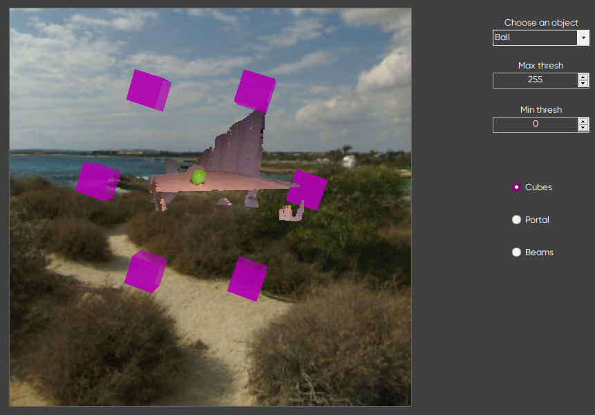
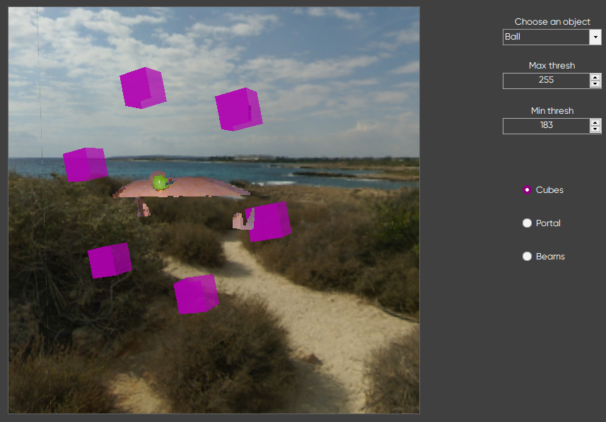
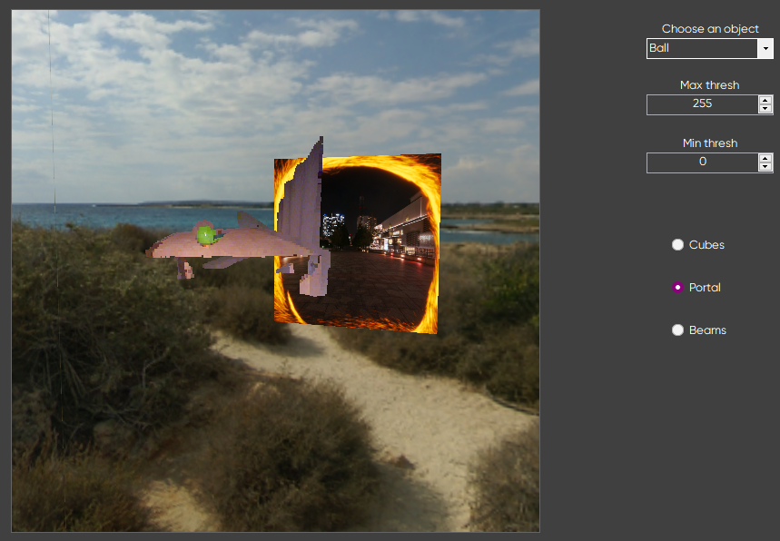
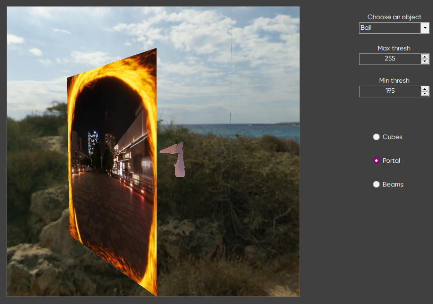
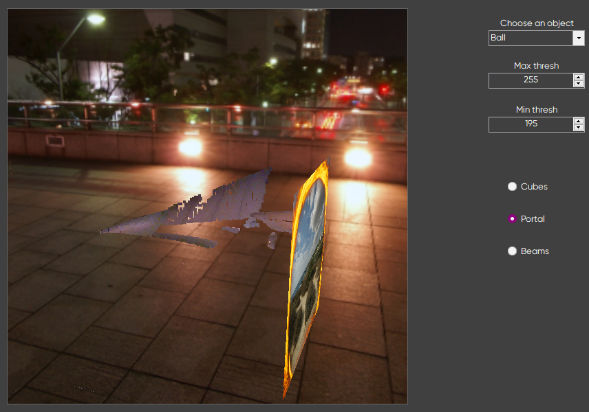
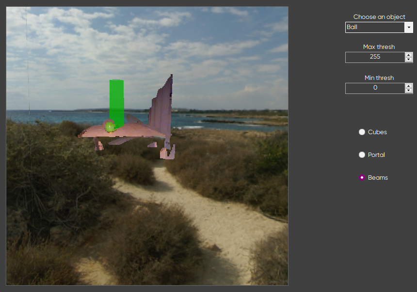

# C# OpenGL Visualisation

This project was created in order to grasp the basics of OpenGL framework and understand means of data visualisation by combining RGB pixels with their representative depth on the image received from a Kinect and drawing them in the Windows Form application.

How does it look in general:

## Usage

Requires Visual Studio and .NET Framework >=4.8. Works only on Windows, sadly.

Download the VS solution with all of the dependencies and run it in the Visual Studio.

## Navigation

Use WASD keyboard keys to navigate inside of the box (doesn't support holding the keys) and click-and-drag with the mouse to look around the environment.

## Features

This Windows Form supports several features:
- choosing a object that would be drawn,
- changing the amount of points shown by tweaking thresholds,
- drawing multiple cubes moving around the object,
- rendering a portal that can pass points and camera through itself,
- drawing a beam at the center of the points cloud.

All of these features are overviewed below.

### Choosing of an object

You can choose an object to display with a `Choose an object` dropdown menu.

The presented are:

- Ball
- Chair
- Globe
- Table sideways
- Table

It does not really change anything but the drawing, just only these pictures were given by the Kinect owner.

You can add your own objects by adding them into the `Images/bmps` folder.

**Keep in mind that it is essential to have both colorised and depth images inside of the folder with the same names prior to the underscore**

### Tweaking thresholds

Changing `Max` and `Min` thresholds results in points that are outside of the set limit not to draw:

### Drawing Cubes

Check the `Cubes` switch to start rendering.

Default representation of the program, so was illustrated at the beginning of the readme.

### Rendering a portal

It is safe to say that developing the portal feature was the driving force of the whole project, because it was invisioned as having an abilty to change environment by passing through the portal.

And it was implemented. 

Choose the `Portal` switch first:

Then, by tweaking thresholds, the portal will move towards the points cloud:

And everything that is outside of the set thresholds goes "beyond" the portal and is invisible from the current point of view.

To change the environment, navigate the camera straight through the portal:

### Drawing a beam

This feature uses simple algorithm to calculate the center point of the cloud and draw a beam from it upwards.

Toggle the `Beams` switch:

